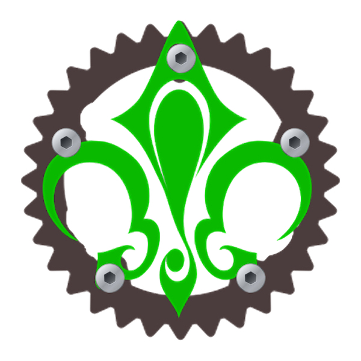
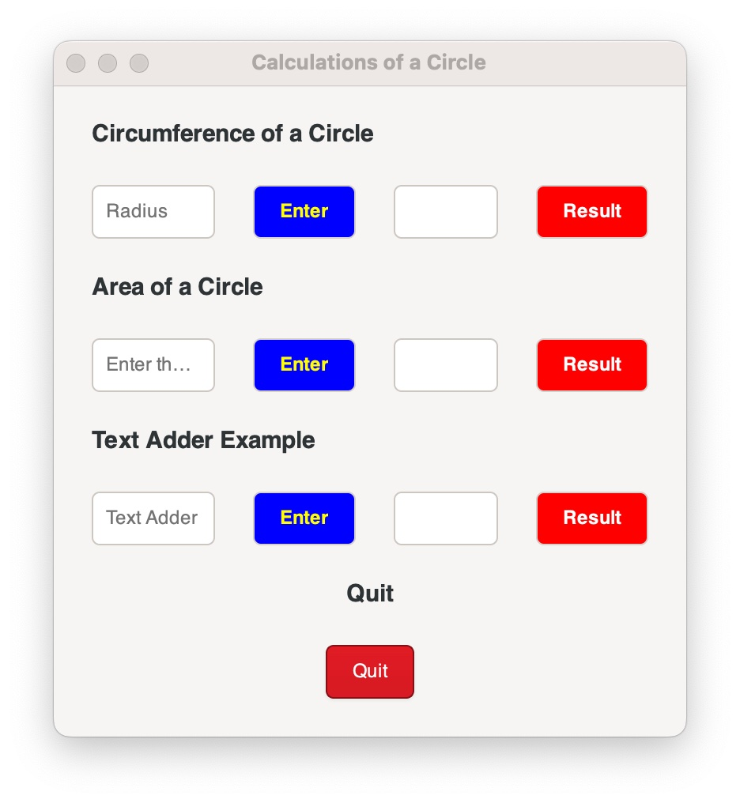
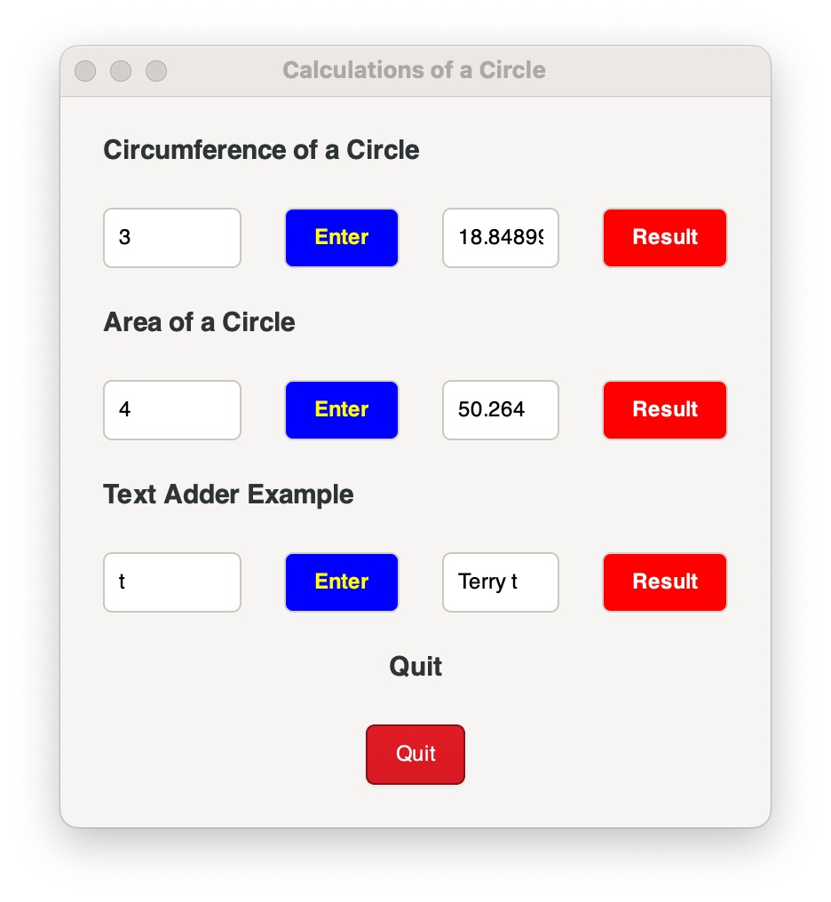

<p align="center">
  <a href="" rel="noopener">
 </a>
</p>

<h3 align="center">Calculations_of_a_Circle</h3>

<div align="center">

[]()

</div>

---

<p align="center">A simple demo of the use of the GTK4 package.
    <br> 
</p>

## 🧐 About <a name = "about"></a>


<p align="center">
  <a href="" rel="noopener">
 </a>
</p>
<p align="center">
  <a href="" rel="noopener">
 </a>
</p>

<p align="center">Screen shots of the app.
    <br> 
</p>

### Three input fields. 

1. The first takes the radius of the circle accepts once the submit button is pressed and displays answer when the calculate button is press.
2. The second takes the radious and calculates the circumference of a circle. with similar actions.
3. The final adds Terry to any text string.

The demo is built using the *container* method, where each block of the GUI is built within a *container* as shown in the code below.  
The variable _btn_ is the button, _with_label_ shows the adjacent text as the label for the button, _btn.connected_clicked_ will upon the _btn_ being clicked grab the text in the screen as a **String**, *text.trim().parse::<f32>().unwrap()* causes the **String** of text to be a type f32.


```rust
let from_entry = gtk::Entry::builder()
    .placeholder_text("Radius")
    .build();
text_container.append(&from_entry);
let btn = gtk::Button::with_label("Enter");
btn.connect_clicked(clone!(@weak clipboard, @weak from_entry => move |_btn| {
    let text = from_entry.text();
    let radius: f32 = text.trim().parse::<f32>().unwrap();
    let circum_circle: f32 = radius * 2. * 3.1415;
    let circumanswer = circum_circle.to_string();
    clipboard.set_text(&circumanswer)
   }));
```

## 🏁 Purpose and Getting Going <a name = "getting_started"></a>

The main purpose of this demo is to provide a code template for creating GUIs for RUST code projects moving forward.  This is really part one of two.  In this first demo/template the layout is constructed in a strict Box Builder container style. Using this paradaigm each element is added in a container stacked progressively downward in the window. The other builder approach not included here is a grid builder pattern.  These builder patterns rely on constructed pre-defined widgets which can be selected from [here](https://docs.gtk.org/gtk4/visual_index.html)

Alternatively a non-builder pattern can be used in gtk which they call a Composite Template.  Where GTK allows for a custom layout to describe the user interface with a markup language - they use XML. see the documentation at (https://gtk-rs.org/gtk4-rs/stable/latest/book/composite_templates.html) 


### Build
  
Build using the "cargo run" command.

### Docs
  
Using "cargo doc" generates the documentation in the .../src/target/docs directory.

### Debug
  
Automatically sets up debugging on the MacOS using VScode and LLDB Code extensions.

#### Prerequisites

Need Vscode with extensions: 
- rust-analyzer
- code lldb

## ⛏️ Built Using <a name = "built_using"></a>

- [vscode](https://www.vscode.com)
- [rust](https://www.rustlang.org)
- [gtk-rs](https://gtk-rs.org)

## ✍️ Author <a name = "author"></a>

- [@iotandwearablesguy](https://github.com/iotandwearablesguy) - Idea & Initial work

## 🎉 Acknowledgements <a name = "acknowledgement"></a>

- [Thank You GTK-RS]([https://simplemaps.com/data/us-cities](https://gtk-rs.org))


 ## LICENSE

_O'Shea-Dishongh No Harm License© 2022 Terrance O'Shea & Katherine Dishongh_

<http://github.com/terryo-iotandwearablesguy>

Subject to the following conditions:

 1. That the below copyright notice and this permission notice shall be included in all copies or substantial portions of the Software.

 2. That any use of the Software under this license never be used for harmful purposes, permission is hereby granted, free of charge, to any person obtaining a copy of this software and associated documentation files (the "Software"), to deal in the Software without restriction,including without limitation the rights to use, copy, modify, merge, publish, distribute, sublicense, and/or sell copies of the Software, and to permit persons to whom the Software is furnished to
 do so subject to the aforementioned restrictions.

"Harmful purposes" as used herein means to not harm destroy or otherwise restrict humans, animals, or the environment. "Harmful purposes" includes, inter alia, the creation of weaponry, the guidance of weapons, limitation of food and services, damaging, contaminating or otherwise hazardous to the environmnet in any form, and/or restricting the freedom or movement of people.

THE SOFTWARE IS PROVIDED "AS IS", WITHOUT WARRANTY OF ANY KIND, EXPRESS OR IMPLIED, INCLUDING BUT NOT LIMITED TO THE WARRANTIES OF MERCHANTABILITY, FITNESS FOR A PARTICULAR PURPOSE AND NONINFRINGEMENT. IN NO EVENT SHALL THE AUTHORS OR COPYRIGHT HOLDERS BE LIABLE FOR ANY CLAIM, DAMAGES OR OTHER LIABILITY, WHETHER IN AN ACTION OF CONTRACT, TORT OR OTHERWISE, ARISING FROM, OUT OF OR IN CONNECTION WITH THE SOFTWARE OR THE USE OR OTHER DEALINGS IN THE SOFTWARE


